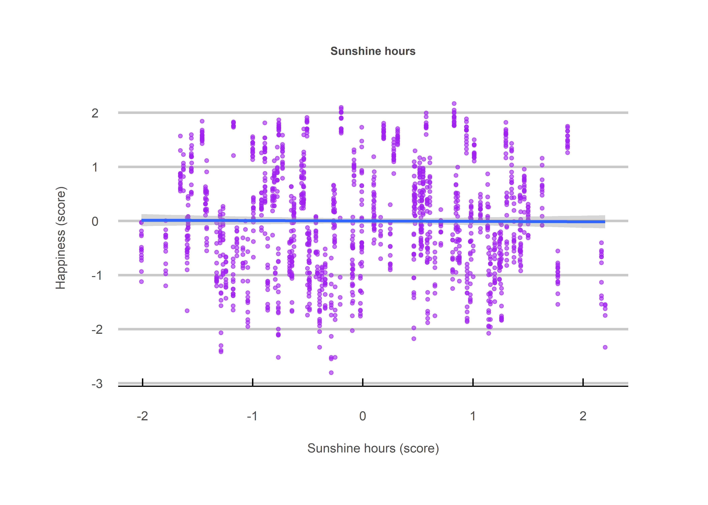
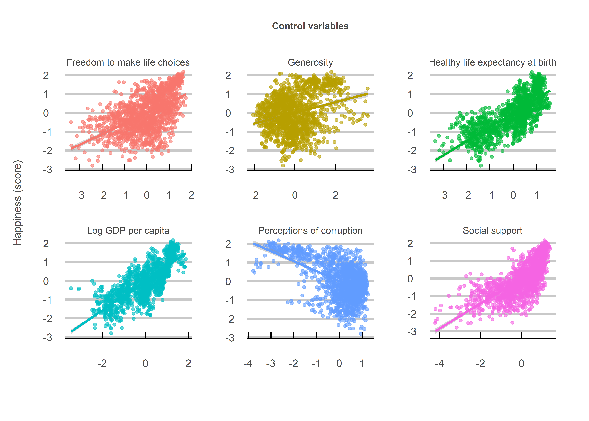
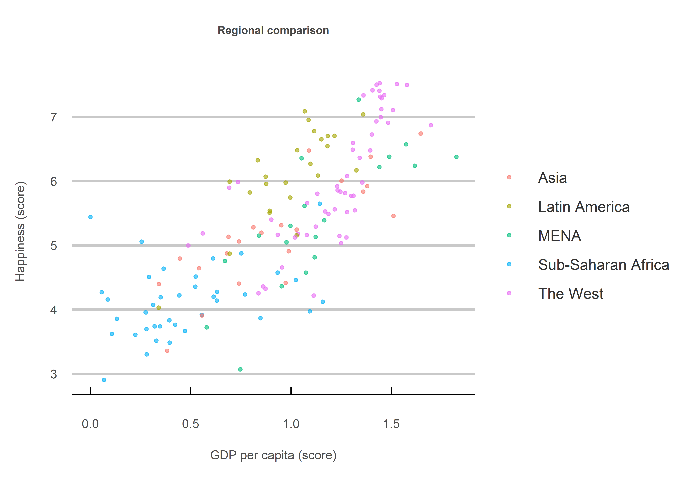

The Pursuit of Happiness
================
Jack Carter
4/8/2023

## **Summary**

Many people think moving somewhere sunny would make them happier. But
[research](https://journals.sagepub.com/doi/abs/10.1111/1467-9280.00066)
from Nobel prize winning laureate Daniel Kahneman suggests that weather
plays virtually no role in our happiness. His findings are supported
here with multiple regression analysis using World Happiness Report and
Kaggle sunshine hours data. The implication is that even if something
makes us happier in the short-run, it might just become our new normal
in the long-run.

 

## **Data**

#### **Sources**

  - [World Happiness Report
    (2022)](https://worldhappiness.report/ed/2022/#appendices-and-data)
  - [Kaggle Sunshine duration by city
    (2022)](https://www.kaggle.com/datasets/prasertk/sunshine-duration-by-city)

 

#### **Dependent variable**

  - Happiness self-evaluations

 

#### **Explanatory variables**

  - Sunshine hours
  - Log GDP per capita
  - Social support, healthy life expectancy at birth
  - Freedom to make life choices
  - Generosity
  - Perceptions of corruption

 

## **Method**

The datasets were merged by country name. All non-matching country names
were examined and changed where different names were used. This yeilded
118 matching countries. Happiness data rows with NA values were
discarded. Sunshine hours values were averaged by country and then
duplicated to match happiness data years (see Limitations below).

 

## **Analysis**

### **1) All countries**

A regression model was fit on all 118 countries using all explanatory
variables.

<!-- --><!-- -->

    ## 
    ## Call:
    ## lm(formula = life_ladder ~ ., data = clean_df)
    ## 
    ## Residuals:
    ##      Min       1Q   Median       3Q      Max 
    ## -1.54295 -0.29504  0.00977  0.29111  1.71973 
    ## 
    ## Coefficients:
    ##                                      Estimate Std. Error t value Pr(>|t|)    
    ## (Intercept)                         1.886e-17  1.196e-02   0.000    1.000    
    ## `Log GDP per capita`                2.935e-01  2.653e-02  11.062   <2e-16 ***
    ## `Social support`                    2.401e-01  1.744e-02  13.766   <2e-16 ***
    ## `Healthy life expectancy at birth`  2.440e-01  2.324e-02  10.498   <2e-16 ***
    ## `Freedom to make life choices`      1.437e-01  1.546e-02   9.293   <2e-16 ***
    ## Generosity                          1.223e-01  1.330e-02   9.198   <2e-16 ***
    ## `Perceptions of corruption`        -1.526e-01  1.499e-02 -10.184   <2e-16 ***
    ## sun                                -4.907e-03  1.204e-02  -0.408    0.684    
    ## ---
    ## Signif. codes:  0 '***' 0.001 '**' 0.01 '*' 0.05 '.' 0.1 ' ' 1
    ## 
    ## Residual standard error: 0.4675 on 1520 degrees of freedom
    ## Multiple R-squared:  0.7825, Adjusted R-squared:  0.7815 
    ## F-statistic: 781.1 on 7 and 1520 DF,  p-value: < 2.2e-16

 

##### Interpretation

The scatterplot for sunshine hours and happiness appears to be
completely random, showing no discernible relationship between the two
whatsoever. This is backed up by the regression results, displaying a
negative relationship and an extremely high p-value of 0.684.

 

### **2) European countries:**

Since it could be argued that Sub-Saharan Africa, a region with
comparatively lower developmental progress and happiness self-evaluation
scores, effectively masks any sunshine hours effect due to its close
proximity to the equator, a second regression model was fit on only
European countries.

<!-- -->

    ## 
    ## Call:
    ## lm(formula = clean_europe_df$`Life Ladder` ~ ., data = clean_europe_df)
    ## 
    ## Residuals:
    ##      Min       1Q   Median       3Q      Max 
    ## -1.42080 -0.22004  0.00336  0.24937  1.27032 
    ## 
    ## Coefficients:
    ##                                      Estimate Std. Error t value Pr(>|t|)    
    ## (Intercept)                         3.318e-17  1.824e-02   0.000   1.0000    
    ## `Log GDP per capita`                2.965e-01  4.576e-02   6.480 2.25e-10 ***
    ## `Social support`                    1.381e-01  2.787e-02   4.956 9.92e-07 ***
    ## `Healthy life expectancy at birth`  7.255e-02  3.446e-02   2.105   0.0358 *  
    ## `Freedom to make life choices`      1.553e-01  3.075e-02   5.052 6.19e-07 ***
    ## Generosity                          9.925e-02  2.344e-02   4.235 2.74e-05 ***
    ## `Perceptions of corruption`        -3.267e-01  3.024e-02 -10.805  < 2e-16 ***
    ## sun                                -2.682e-02  1.892e-02  -1.418   0.1568    
    ## ---
    ## Signif. codes:  0 '***' 0.001 '**' 0.01 '*' 0.05 '.' 0.1 ' ' 1
    ## 
    ## Residual standard error: 0.4058 on 487 degrees of freedom
    ## Multiple R-squared:  0.8377, Adjusted R-squared:  0.8353 
    ## F-statistic:   359 on 7 and 487 DF,  p-value: < 2.2e-16

 

##### Interpretation

The scatterplot illustrates how Sub-Saharan Africa tends to have both
lower economic development and happiness self-evaluation scores. An
exclusively European regression model however still fails to find
support for a sunshine hours effect, showing a negative relationship and
a high p-value of 0.156.

 

## **Limitations**

Missing values in the World happiness Report data were removed due to
the high availability of data. A better approach however would have been
to impute them through machine learning predictions based on NA free
columns. Also, data for sunshine hours were simulated across multiple
years by duplicating each country’s value multiple times. Although these
values are not likely to change much each year, this is generally not a
good practice and should be avoided where possible.
